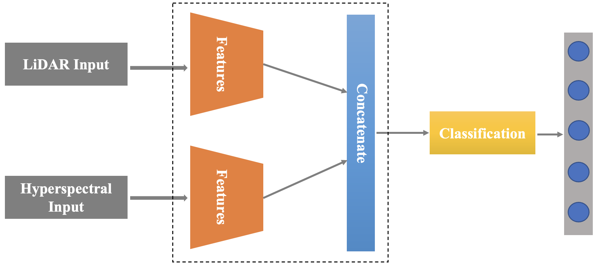

# LiDAR-and-Hyperspectral-Fusion-classification
### Landcover classifcation using the fusion of hyperspectral data and LiDAR neighbourhood region of NxN surrounding a pixel.

<hr>




#### Steps to Run:

1. Create a virtual environment using command: ```virtualenv myenv```
2. Activate the virtual environment: ```source venv/bin/activate ```
3. Install the requirements file: ```pip install -r requirements.txt```
4. Download [this](https://github.com/GatorSense/MUUFLGulfport/blob/master/MUUFLGulfportSceneLabels/muufl_gulfport_campus_1_hsi_220_label.mat) gulfport mat file in the same directory.
5. Run the file: ```python main.py```

<hr>

#### Results:
An accuracy of 93.17% ± 1.20 was achieved. The Confusion matrix is shown below:


#### References

P. Gader, A. Zare, R. Close, J. Aitken, G. Tuell, “MUUFL Gulfport Hyperspectral and LiDAR Airborne Data Set,” University of Florida, Gainesville, FL, Tech. Rep. REP-2013-570, Oct. 2013.

X. Du and A. Zare, “Technical Report: Scene Label Ground Truth Map for MUUFL Gulfport Data Set,” University of Florida, Gainesville, FL, Tech. Rep. 20170417, Apr. 2017.

<hr>
